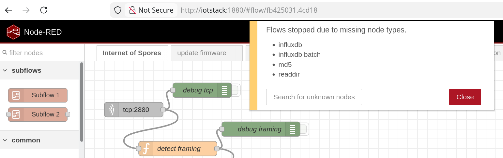
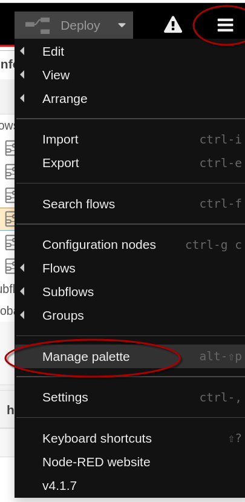
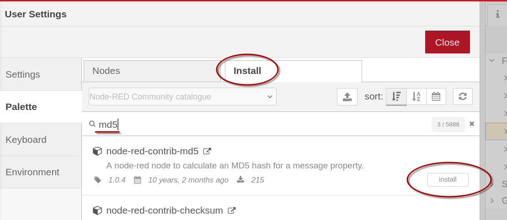
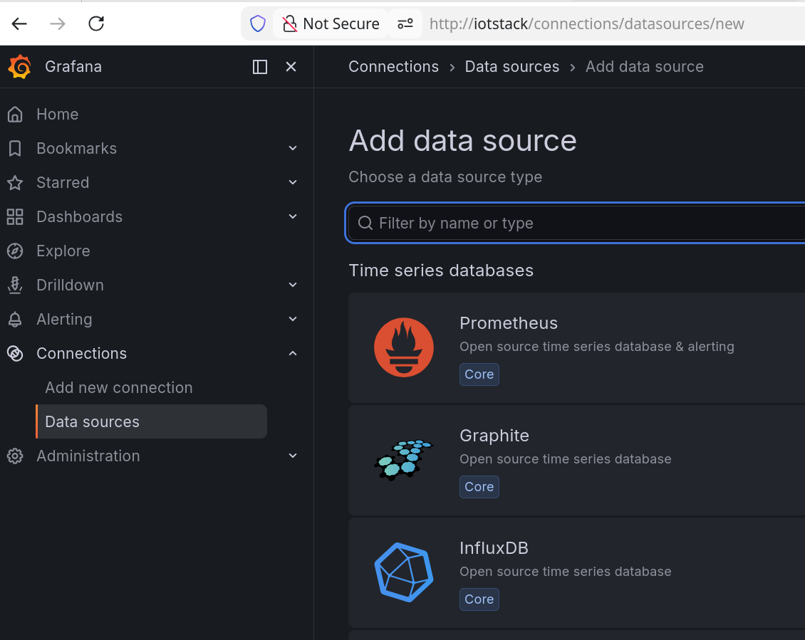
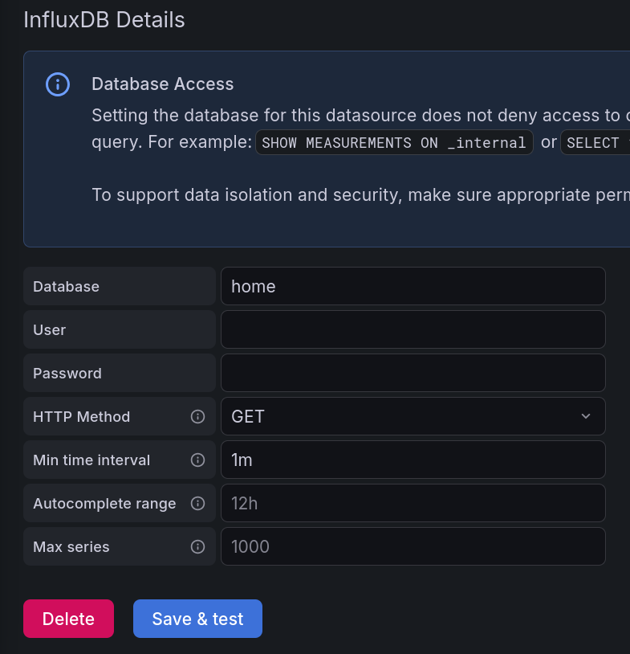
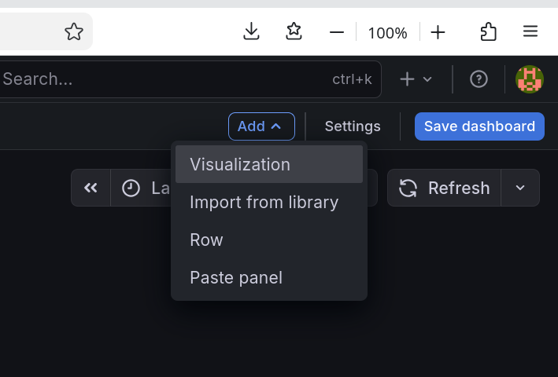
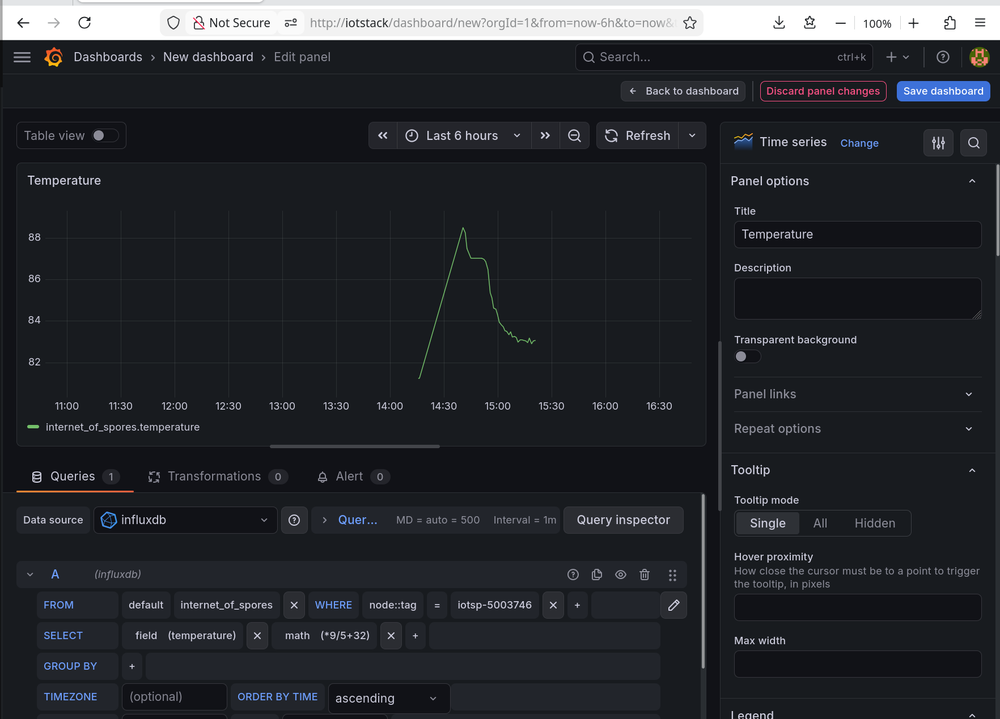
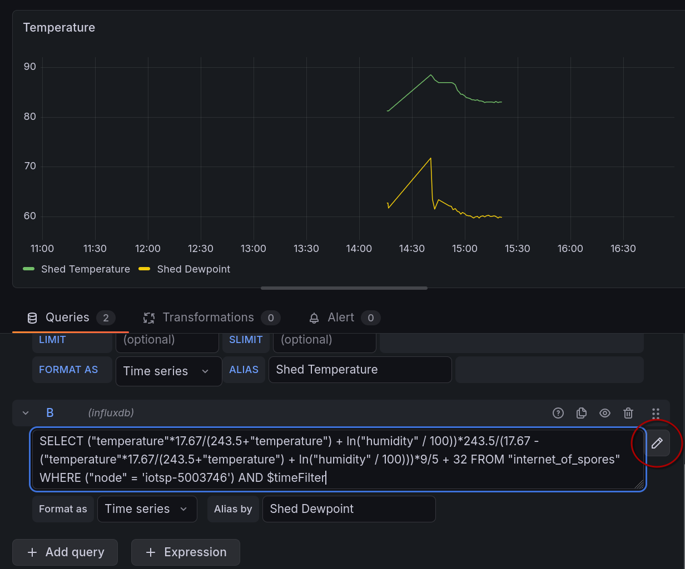

# Server Setup and Configuration

## Table of Contents
* [Documentation Conventions](#documentation-conventions)
* [Installation](#installation)
  - [Prerequisites](#prerequisites)
  - [Grafana Installation](#grafana-installation)
  - [Influx DB Installation](#influx-db-installation)
  - [Node-RED Installation](#node-red-installation)
* [Configuration](#configuration)
  - [Influx DB Configuration](#influx-db-configuration)
  - [Node-RED Configuration](#node-red-configuration)
  - [Grafana Configuration](#grafana-configuration)
  - [Firewall Configuration](#firewall-configuration)

---

## Documentation Conventions
The examples in this document will be targeting installation on a Raspberry Pi
running [Raspberry Pi OS](https://www.raspberrypi.com/software/).

> ⚠️ Attention:  
> The author of this documentation takes no responsibility for your security
> and you run these commands at your own risk.

The following convention will be used:
* Any lines starting with `#` are a comment to provide context or hints related
  to the next command
* Commands to be executed will not start with any special prefix in order to
  aid copy-and-pasting them
  - Command line parameters that are surrounded by brackets `[]` indicate that
    you should substitute your own value for that parameter
* There may be example output from the programs or a need for you to provide
  some input to the program
  - `#>` indicates sample output from the program
  - `#<` indicates input you should provide to the program
  - Any input strings that are surrounded by brackets `[]` indicate that you
    should substitute your own value for that input

Example:
```bash
# comment line to provide context
# for -i, provide the filename of your configuration file
command_to_execute --command-line-options -i [input file]
#> This is output from the program:
#< input you type in
#> More output from the program...
#< [filename] -- provide your desired filename as input

next_command_to_execute
```

---

## Installation
In the next sections, we will be installing Grafana, Influx DB, and Node-RED.
The specific version is not important and the latest version should work, but
here is a list of the versions tested at the time of writing this document:

| External Dependency | Tested Version | Link
|---------------------|----------------|------
| Grafana             | 12.4.1         | https://grafana.com/
| InfluxDB            | 1.6.7          | https://www.influxdata.com/
| Node-RED            | 22.15.0        | https://nodered.org/

For Influx DB, it seems likely that the v1 API is needed. The author of this
document has not experimented with the v2 or v3 APIs.

### Prerequisites
You will need to perform the basic installation and setup for your server
environment. Whether that means flashing a Raspberry Pi image on an SD Card,
initializing a docker container, or installing Linux on a rack server, this
part is left as an exercise for the reader.

At a minimum, your environment will need to provide:
* Local Area Network Connectivity
  - Ability to install software from the internet
  - Ability to start server processes that will listen for TCP/IP connections
    from the sensor nodes
* Ability to administer the server
  - Install software
  - Configure security settings
  - Remote access for administration (recommended)
* Any additional quality-of-life updates (recommended, but not required)
  - Unattended upgrades
  - Session autostart
  - Cloning this repo and/or installing the Arduino IDE
  - Enable ssh access

You will want to configure the hostname so that you can access the grafana
dashboard using a convenient URL. You will also need to know the hostname in
order to configure the sensors later.  
On the Raspberry Pi, the hostname is configured during the OS setup process and
can be changed through the control center or by running `raspi-config`.
```bash
# run terminal menu-based configuration
sudo raspi-config
```

If you don't configure the hostname, you may find that you have to access the
server by IP address. It is good to know the IP address for future debugging as
well. Determine your IP address and write it down.  
```bash
ip addr
#> 1: lo: <LOOPBACK,UP,LOWER_UP> mtu 65536 qdisc noqueue state UNKNOWN group default qlen 1000
#>     link/loopback 00:00:00:00:00:00 brd 00:00:00:00:00:00
#>     inet 127.0.0.1/8 scope host lo
#>        valid_lft forever preferred_lft forever
#>     inet6 ::1/128 scope host noprefixroute 
#>        valid_lft forever preferred_lft forever
#> 2: eth0: <BROADCAST,MULTICAST,UP,LOWER_UP> mtu 1500 qdisc fq_codel state UP group default qlen 1000
#>     link/ether b8:27:eb:0e:2b:d2 brd ff:ff:ff:ff:ff:ff
#>     inet 192.168.1.177/24 brd 192.168.1.255 scope global dynamic noprefixroute eth0
#>        valid_lft 69091sec preferred_lft 69091sec
#>     inet6 2600:1700:4d40:3650::40/128 scope global dynamic noprefixroute 
#>        valid_lft 2638sec preferred_lft 2638sec
#>     inet6 2600:1700:4d40:3650:f082:ab28:9395:fd76/64 scope global dynamic noprefixroute 
#>        valid_lft 3375sec preferred_lft 3375sec
#>     inet6 fe80::d8e0:2b20:f3ac:31f2/64 scope link noprefixroute 
#>        valid_lft forever preferred_lft forever
#> 3: wlan0: <BROADCAST,MULTICAST> mtu 1500 qdisc noop state DOWN group default qlen 1000
#>     link/ether b8:27:eb:5b:7e:87 brd ff:ff:ff:ff:ff:ff

# in the example above, eth0 is the connected network interface and the IPv4
# address is 192.168.1.177
```

It is suggested to clone this repo in a convenient location for easy access to
the various configuration files.
```bash
git clone https://github.com/X-Illuminati/internet_of_spores.git
#> Cloning into 'internet_of_spores'...
#> remote: Enumerating objects: 1266, done.
#> remote: Counting objects: 100% (423/423), done.
#> remote: Compressing objects: 100% (284/284), done.
#> remote: Total 1266 (delta 291), reused 265 (delta 139), pack-reused 843 (from 1)
#> Receiving objects: 100% (1266/1266), 10.60 MiB | 1.63 MiB/s, done.
#> Resolving deltas: 100% (780/780), done.
```

### Grafana Installation
You can essentially follow the [Debian installation instructions](https://grafana.com/docs/grafana/latest/setup-grafana/installation/debian/)
for installation on a Raspberry Pi.

```bash
# add the grafana gpg public key to the APT keyring
sudo wget -O /etc/apt/keyrings/grafana.asc https://apt.grafana.com/gpg-full.key
#> --2026-03-21 21:00:32--  https://apt.grafana.com/gpg-full.key
#> Resolving apt.grafana.com (apt.grafana.com)... 2a04:4e42:83::729, 146.75.78.217
#> Connecting to apt.grafana.com (apt.grafana.com)|2a04:4e42:83::729|:443... connected.
#> HTTP request sent, awaiting response... 200 OK
#> Length: 7881 (7.7K) [text/plain]
#> Saving to: ‘/etc/apt/keyrings/grafana.asc’
#> 
#> /etc/apt/keyrings/grafana.a 100%[==========================================>]   7.70K  --.-KB/s    in 0s      
#> 
#> 2026-03-21 21:00:33 (17.7 MB/s) - ‘/etc/apt/keyrings/grafana.asc’ saved [7881/7881]

# add the grafana repo to the list of APT sources
echo "deb [signed-by=/etc/apt/keyrings/grafana.asc] https://apt.grafana.com stable main" | sudo tee -a /etc/apt/sources.list.d/grafana.list
#> deb [signed-by=/etc/apt/keyrings/grafana.asc] https://apt.grafana.com stable main

# Updates the list of available packages
sudo apt update 
#> Get:1 https://apt.grafana.com stable InRelease [7,661 B]
#> Get:2 https://apt.grafana.com stable/main arm64 Packages [436 kB]                             
#> Get:3 https://apt.grafana.com stable/main armhf Packages [504 kB]                                             
#> Get:4 http://archive.raspberrypi.com/debian trixie InRelease [54.9 kB]                                        
#> Get:5 http://raspbian.raspberrypi.com/raspbian trixie InRelease [15.0 kB]             
#> Get:6 http://archive.raspberrypi.com/debian trixie/main arm64 Packages [422 kB]              
#> Get:7 http://archive.raspberrypi.com/debian trixie/main armhf Packages [418 kB]
#> Get:8 http://raspbian.raspberrypi.com/raspbian trixie/main armhf Packages [15.7 MB]
#> Fetched 69.8 kB in 7s (9,529 B/s)                                                                             
#> 9 packages can be upgraded. Run 'apt list --upgradable' to see them.

# Install the latest OSS release
sudo apt install -y grafana
#> The following packages were automatically installed and are no longer required:
#>   alacarte  gir1.2-gmenu-3.0  gnome-menus  gtk-nop  libgnome-menu-3-0  python3-gi-cairo  retry
#> Use 'sudo apt autoremove' to remove them.
#> 
#> Installing:
#>   grafana
#> 
#> Installing dependencies:
#>   musl
#> 
#> Summary:
#>   Upgrading: 0, Installing: 2, Removing: 0, Not Upgrading: 9
#>   Download size: 177 MB
#>   Space needed: 622 MB / 23.2 GB available
#> 
#> Get:1 http://raspbian.mirror.constant.com/raspbian trixie/main armhf musl armhf 1.2.5-3 [399 kB]
#> Get:2 https://apt.grafana.com stable/main armhf grafana armhf 12.4.1 [177 MB]
#> Fetched 177 MB in 15s (11.9 MB/s)                                                                             
#> Selecting previously unselected package musl:armhf.
#> (Reading database ... 143735 files and directories currently installed.)
#> Preparing to unpack .../musl_1.2.5-3_armhf.deb ...
#> Unpacking musl:armhf (1.2.5-3) ...
#> Selecting previously unselected package grafana.
#> Preparing to unpack .../grafana_12.4.1_armhf.deb ...
#> Unpacking grafana (12.4.1) ...
#> Setting up musl:armhf (1.2.5-3) ...
#> Setting up grafana (12.4.1) ...
#> ### NOT starting on installation, please execute the following statements to configure grafana to start #> automatically using systemd
#>  sudo /bin/systemctl daemon-reload
#>  sudo /bin/systemctl enable grafana-server
#> ### You can start grafana-server by executing
#>  sudo /bin/systemctl start grafana-server
#> Processing triggers for man-db (2.13.1-1) ...
```

Note that grafana will not automatically be started and won't be configured to
autostart when the system boots. We will configure that below in
[Grafana Configuration](#grafana-configuration).

### Influx DB Installation
Influx DB is available as a Raspbian package, so it can be installed directly
through the Add/Remove Software GUI or using APT.

> 🪧 Note:  
> This version is very old and instructions on installing a newer version can
> be found on the [influxdb website](https://docs.influxdata.com/influxdb/v1/introduction/install/).  
> It seems likely that the v1 API is needed. The author of this document has
> not experimented with the v2 or v3 APIs.

Installation from Raspbian package repo:
```bash
sudo apt install -y influxdb influxdb-client
#> Installing:                     
#>   influxdb  influxdb-client
#> 
#> Summary:
#>   Upgrading: 0, Installing: 2, Removing: 0, Not Upgrading: 9
#>   Download size: 6,738 kB
#>   Space needed: 24.8 MB / 22.1 GB available
#> 
#> Get:1 http://raspbian.raspberrypi.com/raspbian trixie/main armhf influxdb armhf 1.6.7~rc0-2+b1 [4,588 kB]
#> Get:2 http://raspbian.raspberrypi.com/raspbian trixie/main armhf influxdb-client armhf 1.6.7~rc0-2+b1 [2,150 #> kB]
#> Fetched 6,738 kB in 1s (4,533 kB/s)        
#> Selecting previously unselected package influxdb.
#> (Reading database ... 163287 files and directories currently installed.)
#> Preparing to unpack .../influxdb_1.6.7~rc0-2+b1_armhf.deb ...
#> Unpacking influxdb (1.6.7~rc0-2+b1) ...
#> Selecting previously unselected package influxdb-client.
#> Preparing to unpack .../influxdb-client_1.6.7~rc0-2+b1_armhf.deb ...
#> Unpacking influxdb-client (1.6.7~rc0-2+b1) ...
#> Setting up influxdb-client (1.6.7~rc0-2+b1) ...
#> Setting up influxdb (1.6.7~rc0-2+b1) ...
#> Processing triggers for man-db (2.13.1-1) ...
```

### Node-RED Installation
Specific instructions for the Raspberry Pi exist at
https://nodered.org/docs/getting-started/raspberrypi.

> ⚠️ Attention:  
> `bash <(curl ...)` and variants are considered insecure. It is recommended to
> peruse [the source](https://raw.githubusercontent.com/node-red/linux-installers/master/deb/update-nodejs-and-nodered)
> and execute it directly if you are satisfied.  
> The author of this documentation takes no responsibility for your security
> and you run these commands at your own risk. It is impossible for the author
> to anticipate future changes in the URL mentioned that may result in system
> compromise or other cyber attacks. Nor can they anticipate potential
> man-in-the-middle attacks that may be targeting your organization or network
> that may replace the script with a different one when piping it into bash.

```bash
bash <(curl -sL https://github.com/node-red/linux-installers/releases/latest/download/update-nodejs-and-nodered-deb)
#>  
#> Node-RED update script for : [user@hostname]
#>  
#> This script checks the version of node.js installed is 16 or greater. It will try to
#> install node 22 if none is found. It can optionally install node 18, 20 or 24 LTS for you.
#>  
#> If necessary it will then remove the old core of Node-RED, before then installing the latest
#> version. You can also optionally specify the version required.
#>  
#> It also tries to run 'npm rebuild' to refresh any extra nodes you have installed
#> that may have a native binary component. While this normally works ok, you need
#> to check that it succeeds for your combination of installed nodes.
#>  
#> To do all this it runs commands as root - please satisfy yourself that this will
#> not damage your Pi, or otherwise compromise your configuration.
#> If in doubt please backup your SD card first.
#>  
#> See the optional parameters by re-running this command with --help
#>  
#> Are you really sure you want to do this ? [y/N] ? 
#< y
#> Would you like to install the Pi-specific nodes ? [y/N] ? 
#< y
#> Running Node-RED install for user iotstack at /home/iotstack on raspbian
#> 
#> 
#> This can take 20-30 minutes on the slower Pi versions - please wait.
#> 
#>   Stop Node-RED                       ✔
#>   Remove old version of Node-RED      ✔
#>   Remove old version of Node.js       ✔   
#>   Install Node v22.15.0               ✔   v22.15.0   Npm 10.9.2
#>   Clean npm cache                     ✔
#>   Install Node-RED core               ✔   4.1.7
#>   Move global nodes to local          -
#>   Npm rebuild existing nodes          ✔
#>   Install extra Pi nodes              ✔
#>   Add shortcut commands               ✔
#>   Update systemd script               ✔        
#>                                       
#> 
#> Any errors will be logged to   /var/log/nodered-install.log
#> All done.
#> You can now start Node-RED with the command  node-red-start
#>   or using the icon under   Menu / Programming / Node-RED
#> Then point your browser to localhost:1880 or http://{your_pi_ip-address}:1880
#> 
#> Started :  Sat Mar 21 10:03:22 PM EDT 2026 
#> Finished:  Sat Mar 21 10:06:19 PM EDT 2026
#>  
#> **********************************************************************************
#>  ### WARNING ###
#>  DO NOT EXPOSE NODE-RED TO THE OPEN INTERNET WITHOUT SECURING IT FIRST
#>  
#>  Even if your Node-RED doesn't have anything valuable, (automated) attacks will
#>  happen and could provide a foothold in your local network
#>  
#>  Follow the guide at https://nodered.org/docs/user-guide/runtime/securing-node-red
#>  to setup security.
#>  
#>  ### ADDITIONAL RECOMMENDATIONS ###
#>   - Remove the /etc/sudoers.d/010_pi-nopasswd file to require entering your password
#>     when performing any sudo/root commands:
#>  
#>       sudo rm -f /etc/sudoers.d/010_pi-nopasswd
#>  
#>   - You can customise the initial settings by running:
#>  
#>       node-red admin init
#>  
#> **********************************************************************************
```

At this point, the install script will run the settings script.
The basic installation is finished, so you can skip this part and run it again
at any point in the future by executing `node-red admin init`.

## Configuration

### Influx DB Configuration
The Node-RED flows will expect a database called `home` which we need to setup
and configure.  
```bash
influx
#> Connected to http://localhost:8086 version 1.6.7~rc0
#> InfluxDB shell version: 1.6.7~rc0
#> >
#< create database home
#> >
```

It is recommended to set up a retention policy for data to prevent the
database from growing too large.
```bash
#< use home
#> Using database home
#> > 
#< create retention policy "one_week" on "home" duration 1w replication 1 default
#> >
```

It can also be useful for the server to provide down-sampled data to reduce
computational load on the client. These continuous queries automatically create
mean (average) and sampled versions of all data fields for 10 minute windows:
```bash
#< create continuous query cq_average_10m on home begin select mean(*) into home.autogen.:MEASUREMENT from home.one_week./.*/ group by time(10m), * end
#> >
#< create continuous query cq_sample_10m on home begin select sample(*, 1) into home.autogen.:MEASUREMENT from home.one_week./.*/ group by time(10m), * end
#> >
```

The reader is encouraged to review the contents of
`/etc/influxdb/influxdb.conf` and make any adjustments as desired.

### Node-RED Configuration
If you didn't already run the initialization script for node-red, you can run
it by executing the following command:
```bash
node-red admin init
```

It will ask several questions. The defaults should be acceptable, but feel
free to configure as-needed.  
The assumptions from here on will be that the settings file is installed at
`$HOME/.node-red/settings.js` and that your flow file is called flows.json.

#### Flow Installation
Copy the [flow.json](../../node-red/flows.json) file to your `.node-red`
directory.
```bash
# use wget to 
wget https://raw.githubusercontent.com/X-Illuminati/internet_of_spores/refs/heads/master/node-red/flows.json -O ~/.node-red/flows.json
#> --2026-03-22 00:19:42--  https://raw.githubusercontent.com/X-Illuminati/internet_of_spores/refs/heads/#> master/node-red/flows.json
#> Resolving raw.githubusercontent.com (raw.githubusercontent.com)... 2606:50c0:8002::154, 2606:50c0:8000::154, #> 2606:50c0:8003::154, ...
#> Connecting to raw.githubusercontent.com (raw.githubusercontent.com)|2606:50c0:8002::154|:443... connected.
#> HTTP request sent, awaiting response... 200 OK
#> Length: 32017 (31K) [text/plain]
#> Saving to: ‘/home/iotstack/.node-red/flows.json’
#> 
#> /home/iotstack/.node-red/fl 100%[==========================================>]  31.27K  --.-KB/s    in 0.005s  
#> 
#> 2026-03-22 00:19:42 (5.79 MB/s) - ‘/home/iotstack/.node-red/flows.json’ saved [32017/32017]

# alternately, clone the repo locally and copy the file to the node-red config
# directory using cp or scp

# assuming you already cloned the repo in the home directory on the server
cp [repo dir]/node-red/flows.json .node-red/
```

#### Link the Firmware and Sensor-Cfg directory
The Node-RED flows will expect to find a directory called `firmware` with any
firmware images for the sensor nodes. In this way, new firmware versions will
automatically be pushed to the sensor nodes when they report-in.

You can either link this directory to the firmware directory in this git
repository (in order to support automatic updates by simply updating the repo),
or you can link it to a convenient download directory.

Link to an empty download directory where you will place firmware files:
```bash
mkdir ~/Downloads/iot-sensor-firmware
ln -s ~/Downloads/iot-sensor-firmware/ ~/.node-red/firmware
ln -s ~/Downloads/iot-sensor-firmware/ ~/firmware
```

Or, link to the repo firmware directory:
```bash
ln -s [repo dir]/firmware/ ~/.node-red/firmware
ln -s [repo dir]/firmware/ ~/firmware
```

> 🪧 Note:  
> It is useful to link the firmware directory in both the home directory and in
> the .node-red directory. It seems that some versions of Node-RED will run
> from the home directory and others will run in the .node-red directory. This
> makes it difficult to determine where the flows will be looking for the
> firmware directory in.  
> You can also adjust the readdir portion of the flows as desired.

Additionally, the flows will look for a directory called `sensor-cfg` that can
be used to remotely update individual sensor's configuration parameters.  
It is recommended to make a directory for this in the user home directory or on
the desktop.
```bash
mkdir ~/Desktop/sensor-cfg
ln -s ~/Desktop/sensor-cfg/ .node-red/
ln -s ~/Desktop/sensor-cfg/
```

#### Systemd Unit Files and SOH Monitoring Setup
Early versions of Node-RED did not come with a systemd unit file, but that
seems to have changed. If you find a unit file is not provided or have issues
running Node-RED as system service, you can check the
[node-red/readme.md](../../node-red/readme.md) in this repo for some unit files
that I have used in the past to manage my Node-RED installation and provide
additional reliability through a state-of-health monitor.

Now that a unit file is provided, start the Node-RED service via systemctl:
```bash
# Start the Node-RED service once
sudo systemctl start nodered.service

# Enable the Node-RED service to start on every boot
sudo systemctl enable nodered.service
#> Created symlink '/etc/systemd/system/multi-user.target.wants/nodered.service' → '/usr/lib/systemd/system/nodered.service'.

# Check the Node-RED service status
systemctl status nodered.service
#> ● nodered.service - Node-RED graphical event wiring tool
#>      Loaded: loaded (/usr/lib/systemd/system/nodered.service; enabled; preset: enabled)
#>      Active: active (running) since Sun 2026-03-22 13:39:34 EDT; 1min 32s ago
#>  Invocation: fc051670dc7f4cd8b42bb2523ab86dcf
#>        Docs: http://nodered.org/docs/hardware/raspberrypi.html
#>    Main PID: 1619 (node-red)
#>       Tasks: 11 (limit: 1555)
#>         CPU: 10.390s
#>      CGroup: /system.slice/nodered.service
#>              └─1619 node-red
#> 
#> Mar 22 13:39:46 iotstack Node-RED[1619]: 22 Mar 13:39:46 - [info] User directory : /home/iotstack/.node-red
#> Mar 22 13:39:46 iotstack Node-RED[1619]: 22 Mar 13:39:46 - [warn] Projects disabled : editorTheme.projects.ena>
#> Mar 22 13:39:46 iotstack Node-RED[1619]: 22 Mar 13:39:46 - [info] Flows file     : /home/iotstack/.node-red/fl>
#> Mar 22 13:39:46 iotstack Node-RED[1619]: 22 Mar 13:39:46 - [warn] Using unencrypted credentials
#> Mar 22 13:39:46 iotstack Node-RED[1619]: 22 Mar 13:39:46 - [info] Waiting for missing types to be registered:
#> Mar 22 13:39:46 iotstack Node-RED[1619]: 22 Mar 13:39:46 - [info]  - influxdb
#> Mar 22 13:39:46 iotstack Node-RED[1619]: 22 Mar 13:39:46 - [info]  - influxdb batch
#> Mar 22 13:39:46 iotstack Node-RED[1619]: 22 Mar 13:39:46 - [info]  - md5
#> Mar 22 13:39:46 iotstack Node-RED[1619]: 22 Mar 13:39:46 - [info]  - readdir
#> Mar 22 13:39:46 iotstack Node-RED[1619]: 22 Mar 13:39:46 - [info] Server now running at http://127.0.0.1:1880/
```

#### Install Additional Palette Nodes
The flows will not yet be running because of the missing palette nodes.  
We need to install these additional contributor nodes through the UI:

| Node-RED Plugin           | Tested Version | Link
|---------------------------|----------------|------
| node-red-contrib-influxdb | 0.7.0          | https://flows.nodered.org/node/node-red-contrib-influxdb
| node-red-contrib-md5      | 1.0.4          | https://flows.nodered.org/node/node-red-contrib-md5
| node-red-contrib-readdir  | 1.0.1          | https://flows.nodered.org/node/node-red-contrib-readdir

The Node-RED UI should be available by using any web browser to connect to your
server on port 1880.

> 🪧 Note:  
> See the [Prerequisites](#prerequisites) section above for information on
> determining your server's IP address and hostname.



Select "Manage palette" from the settings menu:  


Select the "Install" tab and search for the contributor nodes mentioned in the
table above. Click "install" to install each of them.  


### Grafana Configuration

#### Configure the Grafana Server Settings
There are a couple of choices to be made about how you administer Grafana.  
By default the server will listen on port 3000 and will expect user accounts to
be created and have users log in with different roles as far as who can create,
edit, and view the various dashboards.

##### Configure Administration and Security Settings
To allow anonymous access, you will need to edit the `grafana.ini` and change a
few settings. While you are here, look at the other security and analytics
settings to see if there is anything you want to adjust.
```bash
# Edit the config file as root
sudoedit /etc/grafana/grafana.ini
#< [Search for the auth.anonymous section and add/modify the following lines]
#< enabled = true
#< org_role = Admin
#< [Save and quit the editor]
```

##### Listen on Port 80 (http)
If you want the server to listen on port 80 (more typical for webservers) then
you can either redirect incoming traffic to port 80 using `iptables`, or you
can update the `grafana.ini` to have it listen on port 80 directly.

**iptables approach**  
I believe this command will perform the routing with `iptables`, but I haven't
tried it recently:
```bash
sudo iptables -t nat -A PREROUTING -p tcp --dport 80 -j REDIRECT --to-port 3000
```

**direct binding approach**  
To allow Grafana to bind to low numbered ports (below 1024), you will need to
grant it capabilities for net binding. In older versions, this was
straightforward:
```bash
sudo setcap 'cap_net_bind_service=+ep' /usr/sbin/grafana-server
```

However, it seems that newer versions, the systemd unit file is configured to
run in a restricted namespace and the capabilities are not inherited from the
host filesystem. Due to this, you will have to create and override for the 
systemd unit.
```bash
sudo systemctl edit grafana-server.service
```
Edit the file and enter the following content:
```
[Service]
# Give the CAP_NET_BIND_SERVICE capability
CapabilityBoundingSet=CAP_NET_BIND_SERVICE
AmbientCapabilities=CAP_NET_BIND_SERVICE

# A private user cannot have process capabilities on the host's user
# namespace and thus CAP_NET_BIND_SERVICE has no effect.
PrivateUsers=false
```

Now we can edit the configuration file and change the port from 3000 to 80.
```bash
# Edit the config file as root
sudoedit /etc/grafana/grafana.ini
#< [Search for the line that says ;http_port = 3000 and change it to http_port = 80]
#< [Save and quit the editor]

# Start or restart the Grafana Server service
sudo systemctl restart grafana-server.service

# Wait a minute or so and check that it is bound to port 80 as expected:
sudo netstat -tlnp
#> Active Internet connections (only servers)
#> Proto Recv-Q Send-Q Local Address           Foreign Address         State       PID/Program name
#> tcp        0      0 0.0.0.0:22              0.0.0.0:*               LISTEN      831/sshd: /usr/sbin
#> tcp        0      0 127.0.0.1:631           0.0.0.0:*               LISTEN      1578/cupsd
#> tcp        0      0 0.0.0.0:111             0.0.0.0:*               LISTEN      1/init
#> tcp        0      0 127.0.0.1:8088          0.0.0.0:*               LISTEN      818/influxd
#> tcp        0      0 0.0.0.0:1880            0.0.0.0:*               LISTEN      1619/node-red
#> tcp6       0      0 :::22                   :::*                    LISTEN      831/sshd: /usr/sbin
#> tcp6       0      0 :::80                   :::*                    LISTEN      4312/grafana
#> tcp6       0      0 :::111                  :::*                    LISTEN      1/init
#> tcp6       0      0 :::8086                 :::*                    LISTEN      818/influxd
#> tcp6       0      0 :::2880                 :::*                    LISTEN      1619/node-red
#> tcp6       0      0 ::1:631                 :::*                    LISTEN      1578/cupsd
```

#### Enable in Systemd
The following commands will start the Grafana server service
```bash
# Start the Grafana server service once
sudo systemctl start grafana-server.service

# Enable the Grafana server service to start on every boot
sudo systemctl enable grafana-server.service
#> Synchronizing state of grafana-server.service with SysV service script with /usr/lib/systemd/systemd-sysv-install.
#> Executing: /usr/lib/systemd/systemd-sysv-install enable grafana-server
#> Created symlink '/etc/systemd/system/multi-user.target.wants/grafana-server.service' → '/usr/lib/systemd/system/grafana-server.service'.

# Check the Grafana server service status
systemctl status grafana-server.service
#> ● grafana-server.service - Grafana instance
#>      Loaded: loaded (/usr/lib/systemd/system/grafana-server.service; enabled; preset: enabled)
#>      Active: active (running) since Sun 2026-03-22 15:05:36 EDT; 20s ago
#>  Invocation: 1255cbcaf7af49b48c68ea80be4d542f
#>        Docs: http://docs.grafana.org
#>    Main PID: 2388 (grafana)
#>       Tasks: 8 (limit: 1555)
#>         CPU: 4.922s
#>      CGroup: /system.slice/grafana-server.service
#>              └─2388 /usr/share/grafana/bin/grafana server --config=/etc/grafana/grafana.ini --pidfile=/run/graf>
```

#### Configure the Influx Data Source
We will next attach Grafana to the local Influx DB data source.  
Navigate to Connections->Data sources and select the InfluxDB option.  


The defaults here will mostly be appropriate.
* Set the URL to `http://localhost:8086`.
* Under InfluxDB Details:
  - Set Database to `home`
  - Set HTTP Method to GET
  - Set Min time interval to `1m`

  
Select "Save & test" to test the connection to the database, which should give
an indication that it was successful.

#### Create a Dashboard
On the Dashboards tab, you can create new dashboards and organize them into
folders. Grafana uses a simple drag-and-drop interface to let you add and move
panels around on the dashboard.  
Select Add->Visualization from the upper-right corner.  
  

**Basic Example**  
Let's try adding a simple time-series plot.  
Once you select "Time series as the visualization type, you will be able to
configure the panel title and other graphical configurations on the right side.
The query parameters can all be changed by clicking on them and Grafana will
provide a list of valid settings based on the content it finds in the InfluxDB
data source.  
You can use the "ALIAS" field to give your graph a more meaningful name.  
  
Don't forget to click "Save dashboard" to save your changes!

**More Advanced Example**  
You can use raw query mode to see and edit the exact SELECT statement that will
be sent to InfluxDB. This can be used to implement more advanced queries.

In this example, we can implement the a dewpoint calculation by combining
temperature and humidity information in a single query.

Select "Add query" and then click the pencil icon to enter raw query mode.
Then paste in the following query. (NOTE: set the node name as appropriate
for your sensor.)
```sql
SELECT ("temperature"*17.67/(243.5+"temperature") + ln("humidity" / 100))*243.5/(17.67 - ("temperature"*17.67/(243.5+"temperature") + ln("humidity" / 100)))*9/5 + 32 FROM "internet_of_spores" WHERE ("node" = 'iotsp-5003746') AND $timeFilter
```



This will perform the approximation calculation described in
[the Wikipedia article on dewpoint](https://en.wikipedia.org/wiki/Dew_point#Calculating_the_dew_point)
with constants b = 17.67, c = 243.5 °C.

### Firewall Configuration
You will need to allow ports through your firewall for the services provided.
The implementation of this is left as an exercise for the reader, but here are
the list of ports:

| Port Number | Service   | Purpose
|-------------|-----------|--------
| 3000 or 80  | Grafana   | Provide dashboard UI via http
| 1880        | Node-RED  | Provide flow programming UI via http
| 2880        | Node-RED  | The provided flows.json will liston on this port for incoming connections from the sensors
| 8086        | Influx DB | (Optional) Access to Influx DB REST API
